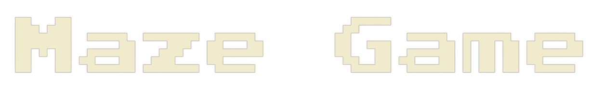
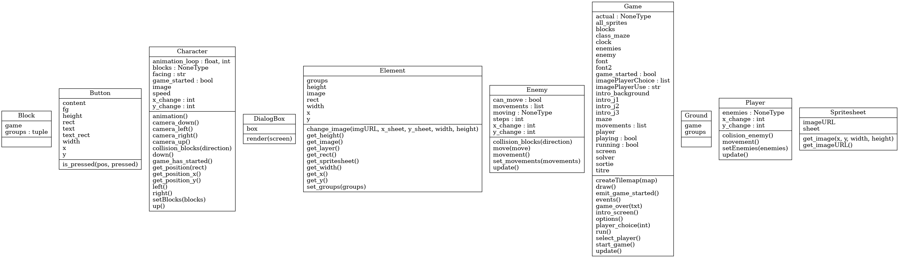
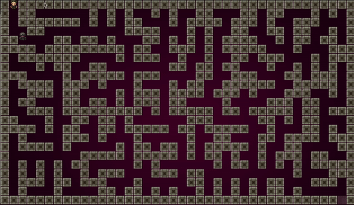
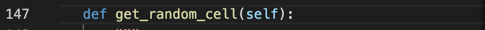

# PROJET 2021/2022



***Binôme :***

    GAUDIERE Yoni
    El KHAYARI Zakaria

## Sommaire
1. [Lancer le jeu](#kk)
2. [Presentation](#introduction)
    1. [rules](#régles)
    2. [Diagramme UML](#diagramme)
3. [Explication](#documentation)
    1. [Maze](#p)
    2. [Solver](#projet-v3)
    3. [Pygame](#projet-v2)
4. [Difficulté rencontré](#howto)
5. [Ce que l'ont aurai voulu ajouter](#tree-du-projet)
6. [source](#ss)
   
#
## Howto


-   Installer les modules python nécessaires :
    ```
    $ make setup
    ```

-   Executer le jeu:

    ```
    $ make game
    ```

-   Executer le tests:

    ```
    $ make test
    ```

-   Effacer les fichies/dossiers inutiles (.pyc et __pychache__):

    ```
    $ make clean
    ```


## Presentation :

Nous avons décidé de créer un petit jeu. 
Pour cela nous avons décidé de coder en python.
Pourquoi python ? Il dispose du module Pygame qui facilite le développement de jeux vidéo. De plus nous n'avons, avant cela, jamais fait de gros projet en python.
#
### rules :
'GAME MAZE' est un petit jeu simple dont le but est de sortir d'un lymbyrinthe. Attention cependant vous n'êtes pas seul a vouloir en sortir et il se pourrait que cette personne ne soit pas aussi gentille que vous... Échappez-vous en premier pour remporter la victoire.

( la sortie ce trouvera toujours en bas à droite )

#
### Diagramme UML :  
 


#

'GAME MAZE' est un petit jeu simple dont le but est de sortir d'un lymbyrinthe. Attention cependant vous n'êtes pas seul a vouloir en sortir et il se pourrait que cette personne ne soit pas aussi gentille que vous... Échappez-vous en premier pour remporter la victoire.
#
### Le Maze :

Une des particularités du jeu et le fait que le lymbitinhe dans lesquelle le joueur va se balader est générer aléatoirement. Il sera donc different à chaque partie.

Pour cela nous arons une classe Maze où l'on retrouvera toutes les méthodes nécessaires ainsi que bien sûr notre algorithme. Celui-ci fonctionne de cette manière :

On commence par créer une grille ( une sort de lymbyrinthe ou tout les murs sont fermer). 

Nous allons commencer par créer une fonction qui créer un lymbirinthe vide   
**methode** : set_univisted_cells(self) 

 **Avec la methode** : set_start() on choisi une case aleatoirement

(on doit aussi vérifier que celui ci ne soit pas au bord du lymbirinte), et ajoutez les mur de celui ci dans une liste de murs.
Nous devons dire que les blocs autour de la cellule de départ sont des murs.

Nous allons ensuite prendre un mur aléatoirement dans notre liste de murs et (regarder si une seule des deux cellules que le mur divise est visitée) on doit donc vérifier les blocs environnants du mur.
Nous devons faire une autre verification car si l'on se trouver sur le premier ligne par exemple il n'y a pas de bloc au dessu et donc nous aurons un indexError.

Nous pourons donc ensuite créer 'un passage' en transformant le mur pour cela on verifie que l'on n'a pas plus d'une cellule autour de lui. ( pour que le lymbirinte n'est pas de parti isolé )

Une fois que l'on c'est occuper de celui ci on le supprime et on passe au prochain.

Toutes ces etapes sont gerées dans la methode generate_maze()

#
### Le Solver : 

Une fois notre lymbirinte créer nous voulons ajouter un ennemie qui se déplacerai de maniére "inteligente" dans le but de nous attraper et de sortir du lymirinte avant nous.  
Nous avons donc besoin d'un algorithme qui calcule un "plus court chemin".  
Le principe de l'algorithme utilisé est le suivant :

Nous créons une matrice avec des zéros de même taille. Mettre un 1 au point de départ.
Partout autour de 1 mettre 2 s'il n'y a pas de mur.
Partout autour de 2 mettre 3 s'il n'y a pas de mur.
etc…
une fois que nous avons mis un nombre au point final, nous nous arrêtons. Ce nombre correspond a la longueur minimale du chemin.

exemple d'utilisation de l'algorithme :  



#
### Pygame :

Nous avons ensuite modélisé cela avec pygame pour créer notre jeu en ajoutant un menu et quelque options.  

### Menu 

Nous avons créé un menu avec plusieurs boutons pour y naviguer.
On a donc créé une classe boutons pour cela.
A chaque fois qu'ont appui sur un bouton ( méthode is_pressed ) on va faire appel à une méthode qui va etre responsable de la page.
Chaque page a donc une méthode propre.

A noter que pour chaque page nous utilisont une boucle while infini.
Ce qui n'est donc pas optimal. Même si sur internet beaucoup de personnes disent de procéder de cette façon il doit y avoir un meilleur moyen.

Nous avons aussi ajouté une sélection de personnages.
Ainsi il vous sera possible de sélectionner un personnage selon votre gout pour vous balader dans le lymbirinte.

Nous avons aussi ajouté une page qui va afficher une gamme over si le joueur se fait toucher et une page de victoire si le joueur arrive à terminer le lymirinte.

#
### Difficulté :

Nous avons eu plusieurs difficultés. 
- par exemple la synchronisation de l'ennemi des mouvements ( même si l'algorithme marche bien il pouvait se bloquer dans un mur). 

- Nous avons eu aussi un problème de coordonner, en effet nous avions au début synchronisé une caméra avec un zoom sur le player mais cela poser problème pour récupérer les coordonner car du coup il n'était pas considéré en mouvement.

- La plus grande difficulté est celle du temps, en effet nous ne pensions pas que créer ce jeu nous demandera autant de temps. 
Nous avons dû abandonner énormément d'idées qui nous tiennent à coeur. 

#

### Ce que l'ont auraient voulu ajouter :

Comme dit précedamant nous avions plein d'idées.
En voici quelqu'une parmi les très nombreuses.

Il était dans notre but que notre player doit trouver une clef et ensuite sortir. Poursuivie en même temps par des ennemie qui le track. Celui ci aurait un algorithme de recherche different en fonction de la difficulté choisie.

Nous voulions aussi rajouter des objets ou une capacité spéciale selon le player sélectionné.  

Il y a d'ailleurs des méthodes créées pour réaliser quelqu'une de ces idées comme par exemple :



Celle-ci permettre de mettre un objet ( une clef par exemple) aléatoirement lors de la création due maze.
#
### Sources

Ce qui nous a aider pour :

le Maze et l'algorithme : ["https://www.youtube.com/watch?v=K7vaT8bZRuk"](https://www.youtube.com/watch?v=K7vaT8bZRuk)

Pygame : ["https://www.youtube.com/watch?v=ooITOxbYVTo&t=1520s"](https://www.youtube.com/watch?v=ooITOxbYVTo&t=1520s)

#


